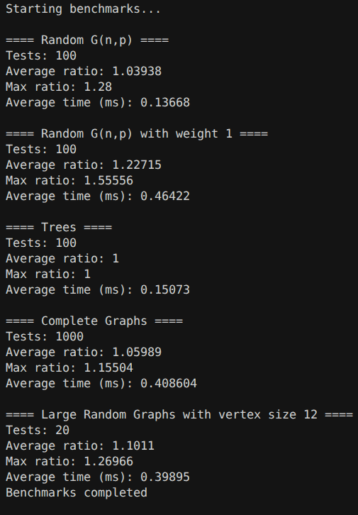
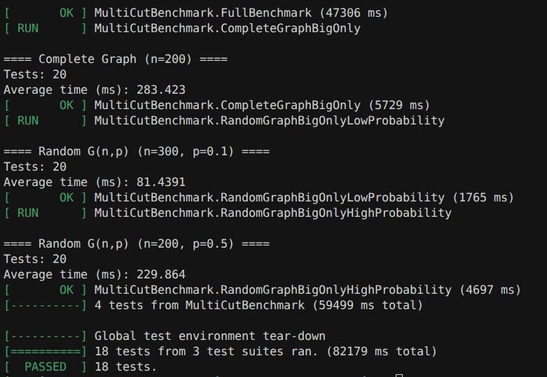

# Computational-Complexity-Project

## Описание

Репозиторий является продолжением статьи Бирюкова Ивана, описывающей $\mathbf{NP}$-полную задачу $\mathbb{MINIMUM \ MULTICUT}$

В данном репозитории будет приведена ее имплементация для $k \ge 2$

## Инструкция к запуску 
### Сборка и запуск

1. **Склонируйте репозиторий**  
   ```sh
   git clone https://github.com/ваш-ник/Computational-Complexity-Project.git
   cd Computational-Complexity-Project
   ```

2. **Сборка проекта с помощью CMake**  
   ```sh
   mkdir -p source/build
   cd source/build
   cmake ..
   make
   ```

   Можно также использовать `./setup.sh`, который дополнительно настраивает файл [.clangd](./.clangd) внутри репозитория

3. **Запуск основного приложения**  
   ```sh
   ./main
   ```

4. **Запуск тестов**  
   Для запуска тестов используйте скрипт:
   ```sh
   ./run_tests.sh
   ```
   или напрямую:
   ```sh
   cd ../../tests
   mkdir build && cd build
   cmake ..
   make
   ./run_tests
   ```

**Требования:**  
- CMake >= 3.10  
- Компилятор C++ (например, g++ >= 9)  
- gtest (GoogleTest) — ставится автоматически в большинстве дистрибутивов, либо через пакетный менеджер

_Замечание: пример запуска показан для Unix-подобных систем (Linux/Mac)_

_Формат ввода и анализа графа показан в main.cpp. Основные тесты лежат в папке [tests](./tests/)._

## Принцип работы

Основные шаги работы алгоритма изложены в статье, здесь будет изложено оно же вместе с дополнением, относящимся к технической части


1. В функции [GetMergedTerminals](./source/Algo.cpp#L24-L45) формируется граф, в котором сливаются все отличные от него терминалы в одну
2. Поскольку реализация решения базируется на алгоритме [Диница](./source/Dinic.hpp), написанном автором во 2 семестре курса алгоритмов и работающим для ориентированных графов, на шаге 1 мы также добавляем обратные ребра и удаляем петли
3. Для полученного графа запускаем алгоритм Диница, повторяя процедуру в [GetMinimumMultiCut](./source/Algo.cpp#L47-L85)
4. Возвращаем сумму результатов пунктов 3 за исключением максимального результата

## Асимптотика

Каждый запуск функции GetMergedTerminals можно оценить в $O(2|E|)$. Каждая итерация функции GetMinimumMultiCut включает в себя асимптотику $O(2|E|)$ от описанной функции и асимптотику алгоритма Диница для графа с $2|E|$ ребрами и $|V| - |T| + 1$ вершинами. 

Пусть $|E| = E, |V| = V, |T| = k$
$$\textbf{Итоговая асимптотика} = O(t \cdot \big(O(2E) + O({2 (V - k + 1)}^2 E)\big)) = O(k V^2E)$$

## Улучшенная асимптотика

Поскольку для единичной сети алгоритм Диница работает за $O(E \sqrt{V})$, итоговая асимптотика становится равна $O(k E \sqrt{V})$

# Тестирование

Для алгоритма написан простейший [проверятор](./tests/dummy.cpp), который перебирает всевозможные разбиения вершин графа на $k$ групп и находит минимальный разрез

## Группы тестов

В папке [tests](./tests/) можно найти файлы, непосредственно относящиеся к тестированию кода

| Группа тестов | Описание | Реализация |
|---|---|---|
| DinicTest | Проверяет корректность реализации алгоритма Диница на небольших графах | Вручную задаём граф (1–3 ребра) и сравниваем `MaxFlow()` с ожидаемым значением |
| TwoTerminalsExact | При $k = 2$ задача сводится к $(s,t)$-разрезу; аппроксимация должна совпасть с точным ответом | 100 раз генерируем полный неориентированный граф на 8 вершинах (веса $1 \ldots 10$), терминалы $\{0, 1\}$; `EXPECT_EQ(GetMinimumMultiCut(), FindBestPartition())` |
| AllVerticesAreTerminals | Все вершины — терминалы: разрез нетривиален, проверяем 2-аппроксимацию | 50 раз — полный граф на 6 вершинах, все вершины в `terminals`; вызываем `CheckApproximation` |
| SimpleGraph | Минимальный случай: 4 вершины, 2 терминала, все пары соединены | 1000 итераций `GenerateRandomGraph(4, 1.0, 2)` + `CheckApproximation` |
| RandomGraphsSmall | Случайные графы малого размера | 100 раз `GenerateRandomGraph(8, 0.4, 3)` + `CheckApproximation` |
| RandomGraphsSmallWithWeight1 | То же, но все веса равны 1 | 100 раз `GenerateRandomGraph(10, 0.4, 5, 1)` + `CheckApproximation` |
| Trees | Случайные деревья | 100 раз `GenerateTreeGraph(10, 3)` + `CheckApproximation` |
| CompleteGraphs | Полные графы | 100 раз `GenerateCompleteGraph(10, 3)` + `CheckApproximation` |
| RandomGraphsLarge | Более крупные случайные графы | 20 раз `GenerateRandomGraph(12, 0.5, 4)` + `CheckApproximation` |
| MultiCutBenchmark | Замеры качества аппроксимации и времени (не assert-тест) | `BenchmarkGraphFamily`: средний/макс. ratio `approx / exact`, среднее время `GetMinimumMultiCut` в мс |
| Productivity | Тесты производительности алгоритма на больших графах | Используется отдельный файл [`Productivity.cpp`](./tests/Productivity.cpp). С помощью генераторов формируются большие случайные либо полные графы , после чего для каждого графа считается только значение аппроксимации (`GetMinimumMultiCut()`), а время выполнения усредняется.

`CheckApproximation` (см. [Generators.hpp](./tests/Generators.hpp)): `approx ≥ exact` и `approx / exact ≤ 2` (при `exact = 0` требуется `approx = 0`).

Запуск: `cmake --build source/build && ./run_tests.sh`

_RandomGraphsLarge_ работает 40 секунд, поскольку оценивается в $\sim 4^{12}$ операций
_

## Анализ производительности





- **Random G(n,p):** средний ratio приближения 1.04, максимальный -- 1.28, время выполнения теста ~0.14 мс.
- **Random G(n,p) с весами 1:** алгоритм показывает больший разброс ratio (средний 1.23, максимальный 1.56), а время теста незначительно выше.
- **Деревья:** как и ожидается для деревьев, аппроксимация точная (ratio = 1).

_Этот факт напрямую следует из доказательства, изложенного в текстовой части_
- **Полные графы:** средний ratio ~1.06, максимальный 1.16, время -- ~0.41 мс на тест.
- **Крупные случайные графы (12 вершин):** средний ratio ~1.10 (максимальный 1.27), время ~0.4 мс.

### Производительность на больших графах (`Productivity.cpp`)

Замеряется только время одного вызова `GetMinimumMultiCut()` (без перебора в `dummy`), 20 прогонов на семейство, $k = 10$ терминалов:

| Семейство графов | Параметры | Среднее время (мс) |
|---|---|---|
| Полный граф | $n = 200$ | **283.4** |
| Случайный $G(n,p)$, разреженный | $n = 300$, $p = 0.1$ | **81.4** |
| Случайный $G(n,p)$, плотный | $n = 200$, $p = 0.5$ | **229.9** |

**Вывод:**

1. **Масштабирование по размеру и плотности.** При переходе от $n \approx 10$ (десятые доли миллисекунды в `FullBenchmark`) к $n = 200\text{–}300$ время растёт на **2–3 порядка** (до сотен миллисекунд). Это согласуется с оценкой $O(k V^2 E)$: у полного графа $|E| \sim V^2$, поэтому полный $K_{200}$ оказывается самым тяжёлым сценарием (~283 мс).

2. **Разреженный граф быстрее плотного при большем $n$.** $G(300, 0.1)$ (~81 мс) обрабатывается **в 3.5 раза быстрее**, чем $G(200, 0.5)$ (~230 мс), хотя вершин больше: при малой вероятности ребра $|E|$ существенно меньше, и Диниц на сжатых сетях вызывается реже по факту объёма графа.

